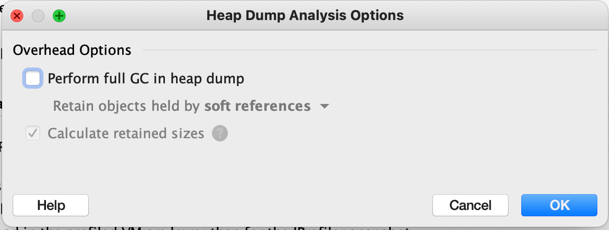
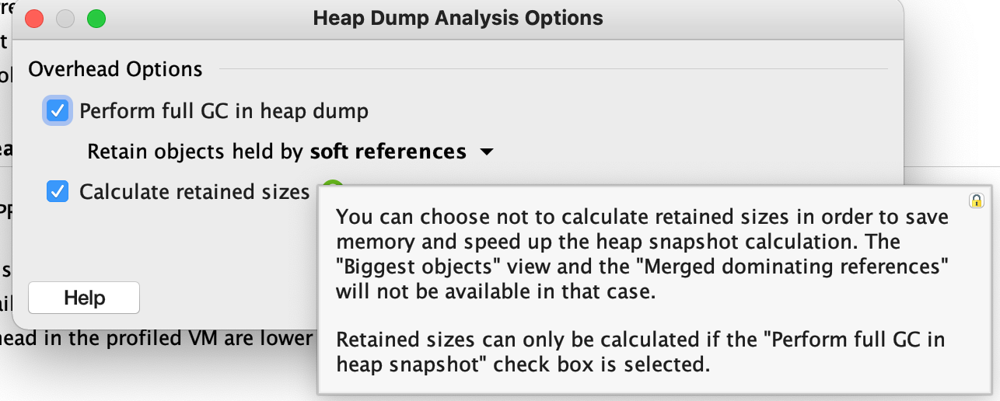
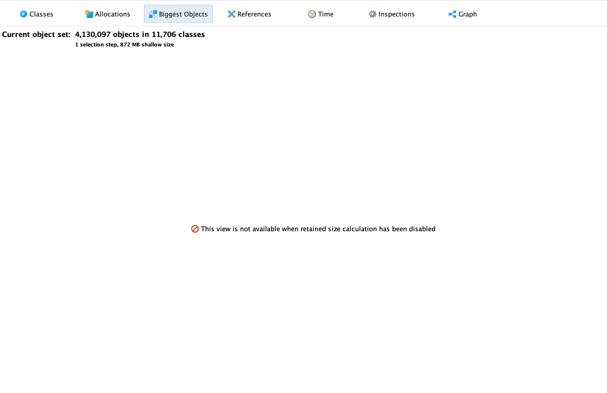
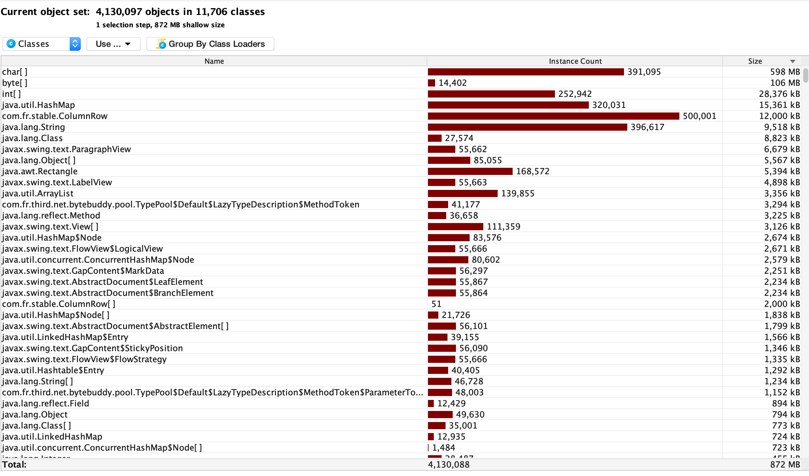

# 对象大小

从dump入手分析

* shallow size
  * 这个对象本身在堆上的占用
* remained size
  * 清理掉这个对象，GC可以回收的内存大小
* deep size
  * 对象引用的所有对象加起来的大小

| 类型                               | 字节                                                         |
| ---------------------------------- | ------------------------------------------------------------ |
| byte                               | 1                                                            |
| boolean                            | 1                                                            |
| short                              | 2                                                            |
| char                               | 2                                                            |
| int                                | 4                                                            |
| float                              | 4                                                            |
| long                               | 8                                                            |
| double                             | 8                                                            |
| -------------------                | ------------------------------------------------------------- |
| 32 bit OS 对对象的引用             | 4                                                            |
| 64 bit OS 对对象的引用             | 8                                                            |
| 64 bit OS 开启指针压缩对对象的引用 | 4                                                            |
|                                    |                                                              |

接上一篇：

shallow size：128 bytes

我们计算一下

头：8+4 = 12

数据体：1+4+8+8+4*19 = 97

109 bytes 加上字节对齐一共112 byte 差了一点

其实我们想一下应该能猜出来，是null jprofiler没有打印null的对象出来

那我们不运行FGC打开dump看下会不会显示为null的对象

去掉FGC的操作之后因为没有遍历gcroot就无法计算retained size了

打开之后发现是没有biggest object的，因为没有遍历一个对象可以释放多少堆空间，所以也没有办法比较他们的大小

直接从class搜ReportSessionIDInfo发现：MD，小婊砸，还是不显示null

那我们就用一下JOL看下明细：

有三个null对象，如果加上 97+4*3 = 109

109+12=121 补7个字节对齐之后 这个报表对象的shallow size就是128bytes

JOL测量的是堆上对象内存占用大小，对象的位置共有有以下三种情况。

- 在方法体内定义的对象，分配在**栈**上
- 作为类成员变量的对象，分配在**堆**上
- 作为类静态成员变量的对象，分配在**方法区**